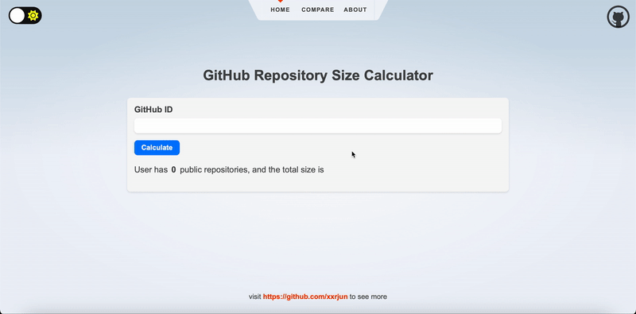

[](https://app.netlify.com/sites/total-repos-size/deploys)

<!-- Show demo in mid -->
<div>
  
</div>

# Total Repos Size

A [simple website](https://total-repos-size.netlify.app) to calculate the combined size of all your GitHub repositories. Which is deployed on [Netlify](https://www.netlify.com/).

**NOTICED**: IT'S ONLY FOR **PUBLIC** REPOSITORIES AND IT'S DIFFERENT FROM THE SIZE DOWNLOADED BY CLONING.

:file_cabinet: 一個簡單計算您所有 GitHub 存儲庫總大小的[網站](https://total-repos-size.netlify.app)。

**注意**: 這個網站僅計算**公開**的 GitHub Repos 的大小，且並非下載後的大小。

## Built with

   

| 類別                          | 名稱                                                                                              |
| ----------------------------- | ------------------------------------------------------------------------------------------------- |
| 前端框架 (Frontend Framework) | [Svelte](https://github.com/sveltejs/svelte)                                                      |
| API 串接 (API Integration)    | [GitHub REST API](https://docs.github.com/en/rest)                                                |
| 部署 (Deploy)                 | [Netlify](https://www.netlify.com/)                                                               |
| 其他工具 (Others)             | [ChatGPT](https://openai.com/blog/chatgpt)、[GitHub Copilot](https://github.com/features/copilot) |

## Todo List

- [x] 顯示使用者上所有 GitHub Repos 的總大小
      Display the total size of all user's GitHub Repos

- [x] 新增暗色模式
      Add Dark Mode
- [x] 關於頁面
      About Page

- [x] 區分單人模式與比較模式
      Separate single mode and compare mode

- [ ] 如果使用者輸入不存在的 GitHub 帳號，要有錯誤訊息
      If the user enters a non-existent GitHub account, an error message should be displayed.

- [x] 查詢結果要新增時間戳記
      Add timestamp to the result

- [ ] 查詢結果 Card 能夠提供使用者下載
      The result can be downloaded by the user

- [ ] 行動裝置 RWD
      RWD for mobile devices

## Getting Started

### 1. 複製儲存庫至本地 Clone this repository

```shell
git clone https://github.com/xxrjun/total-repos-size.git
```

### 2. 安裝套件 Install dependencies

```shell
# Using npm
npm install
```

### 3. 運行應用程式(開發模式) Start the app in development mode

```shell
npm run dev
```

### 4. 打包應用程式 Build the app

```shell
npm run build
```

### 5. 運行應用程式 Start the app in production mode

```shell
npm run start
```

## Usage

How to know your GitHub ID?

In this screenshot, the GitHub ID is `xxrjun`.

<div>
  
</div>

### 1. 單人模式 Single Mode

在輸入框輸入 GitHub 帳號後，按下 Enter 或點擊「查詢」按鈕，即可查詢該帳號下所有 Repos 的總大小。

Enter the GitHub account in the input box, press Enter or click the "Search" button to query the total size of all Repos under the account.

<div>
  
</div>

### 2. 比較模式 Compare Mode

同單人模式

Same as single mode

<div>
  
</div>
